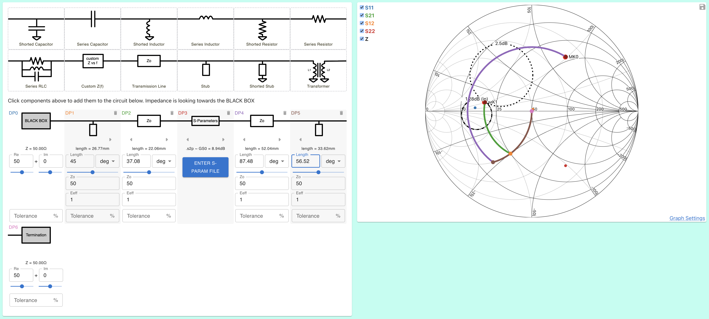

# Tuning a 2-port component to a specific gain

This tutorial is based on (another) Dr. Steve Arar's excellent article
https://www.allaboutcircuits.com/technical-articles/learn-about-designing-unilateral-low-noise-amplifiers/

## Goal

Load an .s2p file and design the matching network for a specific gain and noise figure

[See the end result here](https://onlinesmithchart.com/?circuit=blackBox_50_0_0__stub_45_deg_0_50_1__transmissionLine_37_deg_0_50_1__sparam_s2p_GHz_50_1.4_0.533_176.6_2.8_64.5_0.02_58.4_0.604_-58.3_noise_1.4_1.6_0.5_130_20__transmissionLine_87_deg_0_50_1__stub_56_deg_0_50_1__loadTerm_50_0_0&frequency=1.4&frequencyUnit=GHz&fSpanUnit=GHz&gainInCircles=1.28&nfCircles=2.5&zMarkers=19_4__44_70)

## Instructions

1.  Import .s2p file by clicking the S-Parameter component and copying this file contents

```
# GHz S MA R 50
1.4 0.533 176.6 2.8 64.5 0.02 58.4 0.604  –58.3
! Noise parameters
1.4 1.6  0.5 130 0.4
```

2. Add an input gain circle @1.28dB and a Noise Figure circle @2.5dB

3. We'll match the s-parameter input to the intersect of those two circles - hover over the chart to find its approximately 19 + 4j. For the output we'll match for maximum power-transfer; the complex conjugate of S22 (44 **+** 70j). Add two markers for these points
   

4. Draw the matching network, there's infinite ways to do it. To copy Steve Arar's method (which uses just traces) add open-stub, tx-line on both input and output. The lengths are in units of degrees of λ. See screenshot (45, 37.08, 87.48, 56.52)
   

5. Observe the resulting gain is 12.2dB. The expected gain = Gin (1.28dB) + GS0 (8.9dB - shown next to component) + Gout (1.97dB - maximum gain shown at settings - output gain circles) = 12.15dB, so very close.
   The resulting Noise Figure is 2.522dB, as we designed for

_Note - Steve Arar gets a gain of 12.4dB. This may be because this site uses Unilateral Gain equation, but this component has S21 & S12, so bilateral is more appropriate?_

The


6. Add 5% tolerance to each stub & t-line, see the gain vary from approx. 11.9 to 12.25
   
