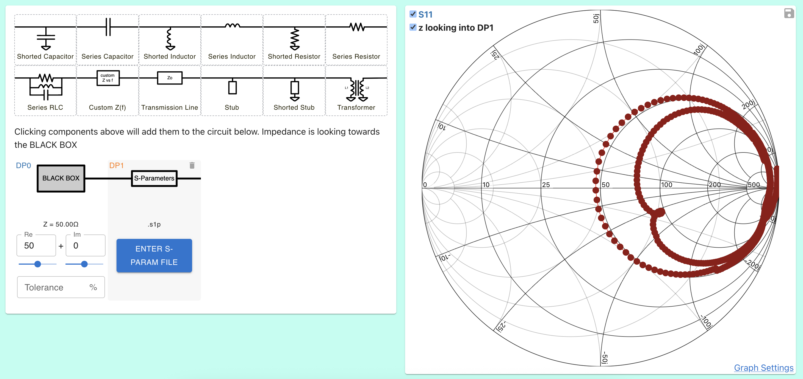
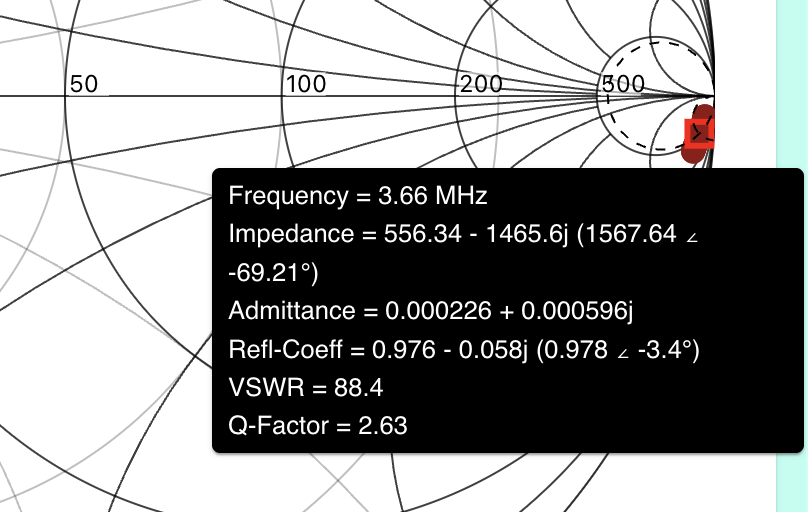
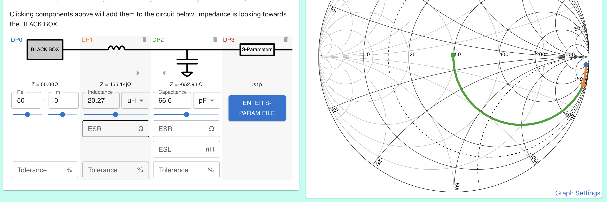
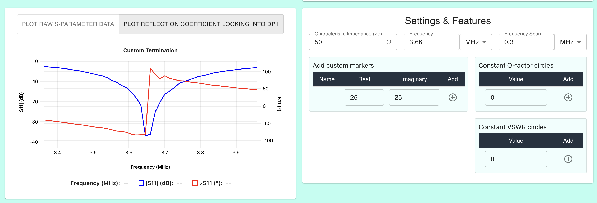
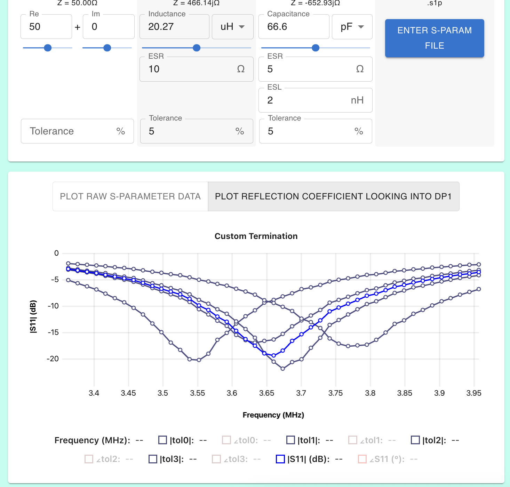

# Tuning an Antenna using .s1p file

This tutorial is based on Wolf's antenna tuning video. The .s1p file is linked in that video and also is in this git repo under [../tests/LOOP1S11.s1p](../tests/LOOP1S11.s1p)

https://www.youtube.com/watch?v=hh8gTWF7uC8

### Goal

Tune the antenna to have maximum transmitted power / minimum reflected power at 3.65MHz.
The antenna .s1p file was collected by physically measuring it with a VNA.

[See the end result here](https://onlinesmithchart.com/?circuit=blackBox_50_0_0__seriesInd_20.27_uH_0_0__shortedCap_66.6_pF_0_0_0__sparam_s1p_Hz_50_3511500_0.9802659212313602_-2.9199579125263373_3525000_0.9797655785487936_-2.9319308457051365_3538500_0.9794188358502212_-2.9881375248638964_3552000_0.979155750088328_-3.083311628579249_3565500_0.9792668546387661_-3.1131373945841796_3579000_0.9785900263804129_-3.164678463215333_3592500_0.978574408948073_-3.1790594857480543_3606000_0.9786771586843497_-3.239826271360699_3619500_0.9782778780580658_-3.280965754407751_3633000_0.9778375428645952_-3.3153842294753177_3646500_0.9774120449462128_-3.4148174055980944_3660000_0.9776347493195231_-3.41642765080948_3673500_0.9773986271780342_-3.4450254842156545_3687000_0.9765330556133035_-3.467689997763812_3700500_0.9773498145678702_-3.5514430497959775_3714000_0.9765224405195219_-3.550661395556074_3727500_0.9762076570276198_-3.5916658533912034_3741000_0.9757718768559303_-3.704375694635003_3754500_0.9759375118777727_-3.7183439347321516_3768000_0.9756202845049563_-3.7419590207577285_3781500_0.9751815265302056_-3.7781418462834053&frequency=3646500&fSpan=270000&frequencyUnit=Hz&fSpanUnit=Hz)

### Instructions

1.  Import .s1p file by clicking the S-Parameter component and copying this file contents [../tests/LOOP1S11.s1p](../tests/LOOP1S11.s1p)
    

2.  Set the frequency to 3.65MHz, and to reduce clutter set the frequency range to 0.5MHz

3.  Hover over the chart to read the antenna S11 at 3.65MHz. Our goal it to match this antenna to 50ohms at 3.65MHz
    _(you have to use 3.66MHz because 3.65MHz wasn't measured in .s1p and this tool does not interpolate)_
    

Note, at this point you could stop with this chart, open a new chart and match your black-box to the complex-conjugate of this impedance. This will give the same matching results as the following steps

Now when components are added to the circuit, the smith chart plots the impedance looking into the antenna; we need to add components bring impedance to 50ohms

4.  Add a matching network. We'll chose the same as the video; 20.27uH series inductor + 66.6pF series capacitor
    

5.  Plot the reflection coefficient and observe minimal reflection at 3.65MHz - just like Wolfs video
    

6.  Add some inductor + capacitor ESR (Q-factor) and tolerances then observe large changes in the antenna tuning.
    
