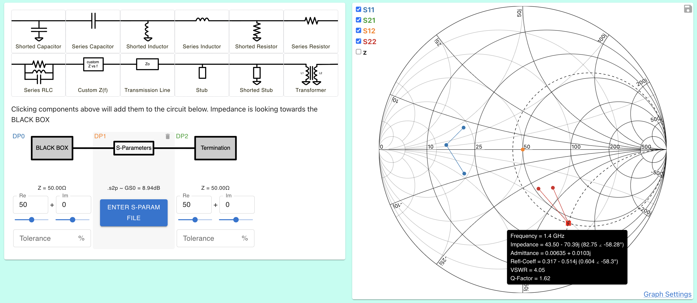

# Tuning a 2-port component to a specific gain

This tutorial is based on Dr. Steve Arar's excellent article
https://www.allaboutcircuits.com/technical-articles/designing-a-unilateral-rf-amplifier-for-a-specified-gain/

### Goal
Load an .s2p file and tune it to have 11dB gain at 1.4GHz

### Instructions

1.  Import .s2p file by clicking the S-Parameter component and copying this file contents [../tests/SteveArarGain.s1p](../tests/SteveArarGain.s2p)
    

Note that gain is Ginput * G0 * Goutput. G0 is shown just below the sparam component for the selected frequency, 8.94dB in this case

2. We will target 11dB gain by setting Ginput = Goutput = 1dB. Add these gain circles
    

3. Starting with the input side we need to move our termination impedance to somewhere on the 1dB circle. We can do this by adding a stub of length 0.08 λ and a transmission line 0.11 λ.
    

4. Do the same with the output termination
    

5. Plot the system gain to see we got 10.99dB at 1.4GHz, pretty good! And the same as the reference article
    

6. Add 5% tolerance to every component to see the gain vary from ~10.75dB to 11.15dB
    

