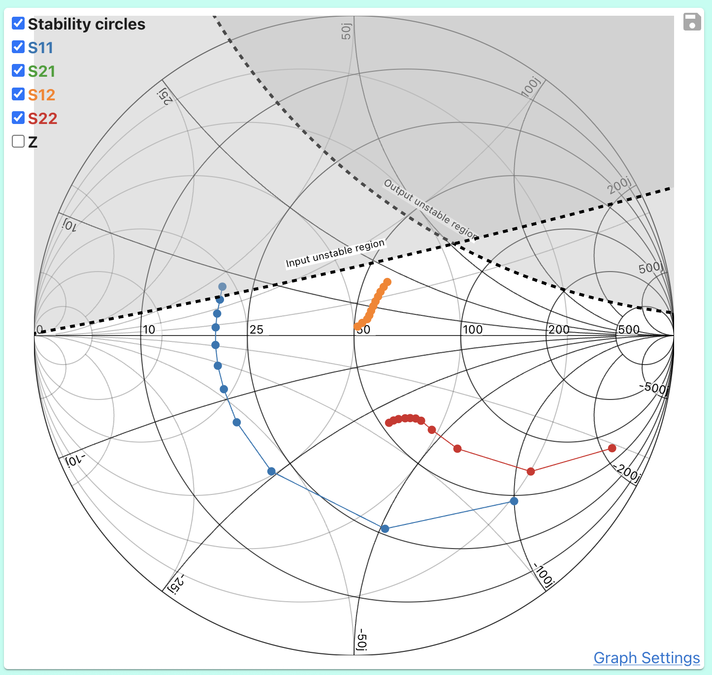

# Analyzing Stability

This tutorial is based on Dr. Steve Arar's stability article
https://www.allaboutcircuits.com/technical-articles/learn-about-unconditional-stability-and-potential-instability-in-rf-amplifier-design/

Stability circles indicate where the s-parameter device would go unstable, which can happen with active devices when the magnitude of reflection coefficient > 1. Oscillation is possible when either the input or output port produces a negative resistance.

### Goal
Plot the stability circles

### Instructions

1.  Import .s2p file by clicking the S-Parameter component and copying these s-parameters
```
# MHz S MA R 50
100    0.720  -46.0    17.973  148.5    0.030   68.5    0.880  -23.6
200    0.612  -80.9    13.927  127.3    0.047   57.1    0.697  -37.6
400    0.497 -121.3     8.656  105.0    0.066   51.3    0.479  -47.6
600    0.456 -143.5     6.080   92.8    0.079   52.9    0.382  -50.5
800    0.440 -157.6     4.725   84.3    0.094   55.4    0.339  -51.8
1000   0.436 -167.5     3.864   77.0    0.110   56.8    0.323  -53.4
1200   0.434 -176.1     3.258   70.3    0.126   57.9    0.312  -55.8
1400   0.433  176.6     2.847   64.5    0.143   58.4    0.304  -58.3
1600   0.433  170.9     2.329   57.4    0.160   58.9    0.296  -62.0
1800   0.434  165.0     2.252   54.2    0.178   58.6    0.293  -65.0
2000   0.439  159.6     2.057   49.2    0.197   58.1    0.294  -68.1
```

2. Set frequency to 100MHz like in the article
    

Is stability inside or outside the circle?
Because `|S22| < 1` the __input__ is stable at the center of the chart (zo + 0j). Therefore, the circles must contain the unstable region. This is marked by labels on the chart